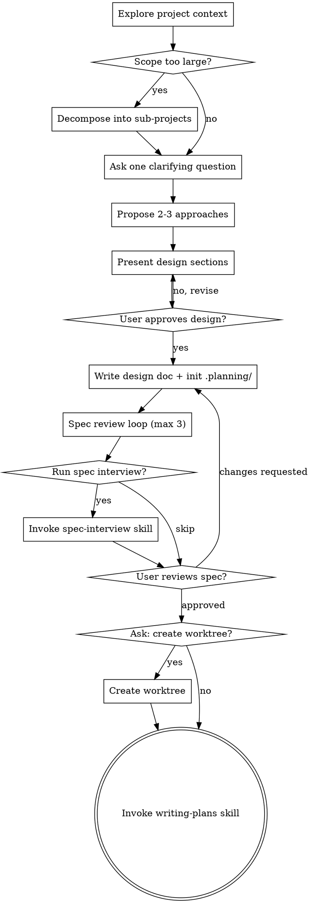

# Brainstorming Ideas Into Designs

Help turn ideas into fully formed designs and specs through natural collaborative dialogue.

**Announce at start:** "I'm using the brainstorming skill to explore this design."

Start by understanding the current project context, then ask questions to refine the idea. Once you understand what you're building, present the design and get user approval.

<EXTREMELY-IMPORTANT>
Do NOT invoke any implementation skill, write any code, scaffold any project, or take any implementation action until you have presented a design and the user has approved it. This applies to EVERY project regardless of perceived simplicity.
</EXTREMELY-IMPORTANT>

## Anti-Pattern: "This Is Too Simple To Need A Design"

Every project goes through this process. A todo list, a single-function utility, a config change — all of them. "Simple" projects are where unexamined assumptions cause the most wasted work. The design can be short (a few sentences for truly simple projects), but you MUST present it and get approval.

## Checklist

You MUST create a task for each of these items and complete them in order:

1. **Explore project context** — check files, docs, recent commits. Save initial findings (project structure, relevant patterns, constraints discovered) to `.planning/findings.md`. Also check `.planning/archive/*.md` for relevant historical archives — if found, read related archives and note relevant Key Decisions and Lessons Learned in `.planning/findings.md` under a `## Historical Context` section.
2. **Scope check** — before refining details, determine whether the request actually describes multiple independent subsystems. If yes, propose decomposition first.
3. **Ask clarifying questions** — ask one question at a time via `AskUserQuestion` to understand purpose, constraints, success criteria. Record key user answers and decisions to `.planning/findings.md`.
4. **Propose 2-3 approaches** — with trade-offs and your recommendation, presented via `AskUserQuestion` for user to choose.
5. **Present design** — in sections scaled to complexity, get user approval after each section via `AskUserQuestion`.
6. **Write design doc** — save to `docs/plans/YYYY-MM-DD-<topic>-design.md`, commit, and initialize `.planning/`.
7. **Spec review loop** — run one reviewer subagent against the written spec. If issues are found, fix and re-run. Maximum 3 rounds.
8. **Spec interview** — ask: "Do you want to run a spec interview to refine details in the design?" (default: yes). If yes, invoke `superpower-planning:spec-interview` with the design doc as target. If user skips, proceed.
9. **User review gate** — explicitly ask the user to review the written spec before planning.
10. **Ask about worktree** — use `AskUserQuestion` to ask whether to create an isolated git worktree for implementation (invoke `superpower-planning:git-worktrees` if yes, skip if no).
11. **Transition to implementation** — invoke writing-plans skill to create implementation plan.

## Process Flow

**The terminal state is invoking writing-plans.** The allowed intermediate skills before writing-plans are: `spec-interview` (to refine the design) and `git-worktrees` (to isolate work). Do NOT invoke any implementation skill.

## The Process

**Understanding the idea:**
- Check out the current project state first (files, docs, recent commits)
- Before asking detailed questions, check whether the project is too large for a single spec
- If the request covers multiple independent subsystems, decompose it first and brainstorm only the first sub-project through the normal flow
- Ask **one question at a time** per `AskUserQuestion` call
- Prefer multiple choice options when possible, but open-ended is fine too
- Focus on purpose, constraints, success criteria

**Exploring approaches:**
- Propose 2-3 different approaches with trade-offs via `AskUserQuestion`
- Lead with your recommended option and explain why
- Include trade-off descriptions in each option

**Presenting the design:**
- Once you understand what you're building, present the design
- Scale each section to its complexity: a few sentences if straightforward, up to 200-300 words if nuanced
- Use `AskUserQuestion` after each section to confirm it looks right
- Cover architecture, components, data flow, error handling, testing
- Design for **clear boundaries and isolated responsibilities**
- Prefer smaller, focused files over large do-everything files
- If a file has grown unwieldy, include a split in the design when it directly serves the current task

## After the Design

**Documentation:**
- Write the validated design to `docs/plans/YYYY-MM-DD-<topic>-design.md`
- Use elements-of-style:writing-clearly-and-concisely skill if available
- Commit the design document to git

**Initialize `.planning/` directory:**
- Run `${CLAUDE_PLUGIN_ROOT}/scripts/init-planning-dir.sh` to create the directory with canonical templates
- Populate the Task Status Dashboard in `progress.md` with tasks derived from the design
- Move any design exploration findings (rejected approaches, discovered constraints, useful references) into `.planning/findings.md`

**Spec Review Loop:**
After writing the spec document:
1. Dispatch one reviewer subagent using `skills/subagent-driven/spec-reviewer-prompt.md` as the review template
2. Prefer the standard dispatch shape in `skills/subagent-driven/spec-review-dispatch-template.md`
3. If issues are found: fix the spec, re-dispatch, and repeat
4. Maximum 3 iterations; if still unresolved, surface the conflict to the user
5. Reviewer findings should be recorded in an agent-specific planning dir under `.planning/agents/`

**User Review Gate:**
After the spec review loop passes, ask the user to review the written spec before proceeding.

**Implementation:**
- Invoke the writing-plans skill to create a detailed implementation plan
- writing-plans is the terminal step. (`spec-interview` and `git-worktrees` are allowed intermediate steps before it.)

## Key Principles

- **Always use AskUserQuestion** — all user-facing questions MUST use this tool
- **One question per call** — don't overwhelm; break complex topics into multiple calls
- **Multiple choice preferred** — easier to answer than open-ended when possible
- **YAGNI ruthlessly** — remove unnecessary features from all designs
- **Explore alternatives** — always propose 2-3 approaches before settling
- **Incremental validation** — present design, get approval before moving on
- **Be flexible** — go back and clarify when something doesn't make sense
- **Large systems must decompose** — do not let one spec sprawl across multiple independent subsystems
- **Small, focused files** — file boundaries and responsibilities should be explicit before planning
