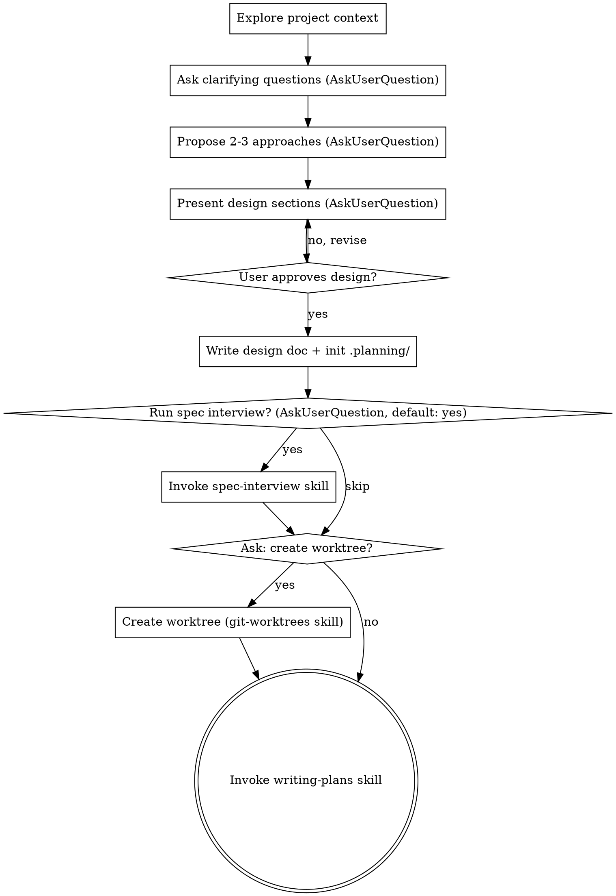

# Brainstorming Ideas Into Designs

## Overview

Help turn ideas into fully formed designs and specs through natural collaborative dialogue.

Start by understanding the current project context, then ask questions to refine the idea. Once you understand what you're building, present the design and get user approval.

<HARD-GATE>
Do NOT invoke any implementation skill, write any code, scaffold any project, or take any implementation action until you have presented a design and the user has approved it. This applies to EVERY project regardless of perceived simplicity.
</HARD-GATE>

## Anti-Pattern: "This Is Too Simple To Need A Design"

Every project goes through this process. A todo list, a single-function utility, a config change — all of them. "Simple" projects are where unexamined assumptions cause the most wasted work. The design can be short (a few sentences for truly simple projects), but you MUST present it and get approval.

## Checklist

You MUST create a task for each of these items and complete them in order:

1. **Explore project context** — check files, docs, recent commits. **Save initial findings** (project structure, relevant patterns, constraints discovered) to `.planning/findings.md`. Also check `.planning/archive/*.md` for relevant historical archives — if found, read related archives and note relevant Key Decisions and Lessons Learned in `.planning/findings.md` under a `## Historical Context` section.
2. **Ask clarifying questions** — 1-2 related questions per `AskUserQuestion` call, understand purpose/constraints/success criteria. Record key user answers and decisions to `.planning/findings.md`
3. **Propose 2-3 approaches** — with trade-offs and your recommendation, presented via `AskUserQuestion` for user to choose
4. **Present design** — in sections scaled to their complexity, get user approval after each section via `AskUserQuestion`
5. **Write design doc** — save to `docs/plans/YYYY-MM-DD-<topic>-design.md`, commit, and initialize `.planning/`
6. **Spec interview** — use `AskUserQuestion` to ask: "Do you want to run a spec interview to refine details in the design?" (default: yes). If yes, invoke `superpower-planning:spec-interview` with the design doc as target. If user skips, proceed.
7. **Ask about worktree** — use AskUserQuestion to ask whether to create an isolated git worktree for implementation (invoke `superpower-planning:git-worktrees` if yes, skip if no)
8. **Transition to implementation** — invoke writing-plans skill to create implementation plan

## Process Flow

**The terminal state is invoking writing-plans.** The allowed intermediate skills before writing-plans are: `spec-interview` (to refine the design) and `git-worktrees` (to isolate work). Do NOT invoke any implementation skill (frontend-design, mcp-builder, etc.).

## The Process

**Understanding the idea:**
- Check out the current project state first (files, docs, recent commits)
- Ask 1-2 related questions per `AskUserQuestion` call to refine the idea
- Prefer multiple choice options when possible, but open-ended is fine too
- 1-2 questions per `AskUserQuestion` call - if a topic needs more exploration, break it into multiple calls
- Focus on understanding: purpose, constraints, success criteria

**Exploring approaches:**
- Propose 2-3 different approaches with trade-offs via `AskUserQuestion` options
- Lead with your recommended option (mark as "(Recommended)") and explain why
- Include trade-off descriptions in each option

**Presenting the design:**
- Once you believe you understand what you're building, present the design
- Scale each section to its complexity: a few sentences if straightforward, up to 200-300 words if nuanced
- Use `AskUserQuestion` after each section to confirm it looks right
- Cover: architecture, components, data flow, error handling, testing
- Be ready to go back and clarify if something doesn't make sense

## After the Design

**Documentation:**
- Write the validated design to `docs/plans/YYYY-MM-DD-<topic>-design.md`
- Use elements-of-style:writing-clearly-and-concisely skill if available
- Commit the design document to git

**Initialize `.planning/` directory:**
- Run `${CLAUDE_PLUGIN_ROOT}/scripts/init-planning-dir.sh` to create the directory with canonical templates
- Populate the Task Status Dashboard in `progress.md` with tasks derived from the design
- Move any design exploration findings (rejected approaches, discovered constraints, useful references) into `.planning/findings.md`

**Implementation:**
- Invoke the writing-plans skill to create a detailed implementation plan
- writing-plans is the terminal step. (spec-interview and git-worktrees are allowed intermediate steps before it.)

## Key Principles

- **Always use AskUserQuestion** - ALL user-facing questions MUST use this tool. Never ask in plain text and wait for a response.
- **1-2 related questions per call** - Don't overwhelm; break complex topics into multiple calls
- **Multiple choice preferred** - Easier to answer than open-ended when possible
- **YAGNI ruthlessly** - Remove unnecessary features from all designs
- **Explore alternatives** - Always propose 2-3 approaches before settling
- **Incremental validation** - Present design, get approval before moving on
- **Be flexible** - Go back and clarify when something doesn't make sense
