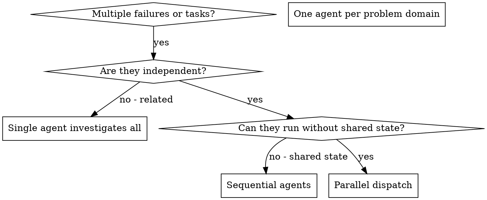

# Dispatching Parallel Agents

## Overview

When you have multiple unrelated failures or work items, investigating them sequentially wastes time. The value of this pattern is strict independence: each agent gets isolated context, one narrow goal, and a role-owned planning directory that can be aggregated back into top-level `.planning/`.

**Core principle:** Dispatch one agent per independent problem domain, but keep planning storage on one directory per role, reused across tasks. Express narrow scope in the prompt or task text, not in the directory name.

## When to Use



**Use when:**
- 2+ failures have different root causes
- Multiple subsystems are broken independently
- Each problem can be understood without context from the others
- Agents will not edit the same files or depend on the same intermediate state

**Don't use when:**
- Failures are related and one fix might resolve several symptoms
- You still need whole-system diagnosis before scoping work
- Agents would interfere with each other through shared files, setup, or runtime state
- The task is still exploratory and the independent domains are not yet proven

## The Pattern

### 1. Confirm Independence First

Before dispatching, verify all of the following:
- Each agent can make progress without waiting on another agent's findings
- The tasks do not require a shared edit sequence
- The likely root causes live in different files, subsystems, or behaviors
- Aggregation can happen after the agents return, not during investigation

If any item fails, do not parallelize yet.

### 2. Prepare Role Planning Directories

Before dispatching, make sure each concurrently running agent has its own role directory:

```bash
mkdir -p .planning/agents/investigator-a/
mkdir -p .planning/agents/investigator-b/
mkdir -p .planning/agents/investigator-c/
```

Use one directory per role and reuse it across tasks. Do not create per-task or domain-suffixed directories.

If you need narrow scope, put it in the prompt or task text:
- which test file or subsystem to inspect
- which constraints to honor
- what output to return

### 3. Create Focused Agent Tasks

Each agent gets:
- **Specific scope:** One file, subsystem, or bounded problem domain
- **Clear goal:** What must be explained, fixed, or verified
- **Constraints:** What not to touch
- **Planning dir:** Path to its `.planning/agents/{role}/` directory
- **Planning rules:** The structured knowledge-capture rules from planning-foundation
- **Expected output:** Summary of findings, changes, risks, and verification

### 4. Dispatch in Parallel

```typescript
Task("Investigate src/agents/agent-tool-abort.test.ts failures. Scope is only this file and its direct support code.\n\nPlanning dir: .planning/agents/investigator-a/\n[planning rules]")
Task("Investigate src/events/batch-completion-behavior.test.ts failures. Scope is only this file and its direct support code.\n\nPlanning dir: .planning/agents/investigator-b/\n[planning rules]")
Task("Investigate src/tools/tool-approval-race-conditions.test.ts failures. Scope is only this file and its direct support code.\n\nPlanning dir: .planning/agents/investigator-c/\n[planning rules]")
```

The planning directory identifies the role. The prompt text identifies the narrow task.

### 5. Review, Aggregate, and Integrate

When all agents return:

**Batch aggregation:**
1. Read each agent's `.planning/agents/{role}/findings.md` and `progress.md`
2. Extract critical items, errors, and verification results from each
3. Append the durable conclusions to top-level `.planning/findings.md`
4. Update top-level `.planning/progress.md` with completion status and integration notes

**Integration:**
1. Read each agent summary
2. Check for edit conflicts or hidden dependencies
3. Run the full verification command or test suite
4. Integrate only after the combined result still passes

Example aggregation:

```markdown
<!-- Append to .planning/findings.md -->
## Parallel Fix Session: Test Failures

### Agent: investigator-a
- Scope: `src/agents/agent-tool-abort.test.ts`
- Root cause: race condition in abort handler timing
- Fix: replaced `setTimeout` with event-based waiting
- [From agent] > **Critical for Orchestrator:** abort handler still depends on upstream edge-case behavior

### Agent: investigator-b
- Scope: `src/events/batch-completion-behavior.test.ts`
- Root cause: `threadId` stored in the wrong event position
- Fix: moved `threadId` to the expected top-level property

### Agent: investigator-c
- Scope: `src/tools/tool-approval-race-conditions.test.ts`
- Root cause: async tool execution not awaited
- Fix: added the missing await before assertions

<!-- Append to .planning/progress.md -->
- [x] Parallel fix session: 3 agents dispatched
  - investigator-a: COMPLETED (`agent-tool-abort.test.ts`)
  - investigator-b: COMPLETED (`batch-completion-behavior.test.ts`)
  - investigator-c: COMPLETED (`tool-approval-race-conditions.test.ts`)
  - Integration: all fixes remained independent and verified together
```

## Agent Prompt Structure with Planning

Good agent prompts keep the directory stable and move scope into the task text:

```markdown
Investigate the 3 failing tests in `src/agents/agent-tool-abort.test.ts`:

1. "should abort tool with partial output capture" - expects `interrupted at` in message
2. "should handle mixed completed and aborted tools" - fast tool aborted instead of completed
3. "should properly track pendingToolCount" - expects 3 results but gets 0

Scope is only this test file and the direct abort flow it exercises.

## Planning Directory

Your planning directory is: `.planning/agents/investigator-a/`

You MUST follow the planning rules from `planning-foundation/templates/agent-context.md`.

Mark critical items with: `> **Critical for Orchestrator:** [description]`

## Your Task

1. Read the test file and understand what each test verifies
2. Identify the root cause
3. Fix by:
   - replacing arbitrary timeouts with event-based waiting where appropriate
   - fixing abort implementation bugs if found
   - adjusting expectations only if the test is asserting obsolete behavior

Do NOT widen scope beyond this failure family.

Return: summary of what you found, what you changed, and how you verified it.
```

## Common Mistakes

**Parallelizing related failures:** Fixing one root cause may resolve several symptoms. Prove independence first.

**Encoding scope in the directory name:** Reuse a stable role directory and put the narrow scope in the prompt text instead of inventing task-specific directory names.

**Broad prompt:** "Fix all the tests" gives the agent too much surface area. Name the exact file or subsystem.

**Missing constraints:** Without boundaries, agents may refactor unrelated code.

**Two live agents sharing one role dir:** Each concurrently running agent needs its own role directory. Reuse that directory later across tasks, but not across simultaneous agents.

## When NOT to Use

**Related failures:** Investigate together first.

**Need full context:** Whole-system diagnosis should happen before splitting work.

**Exploratory debugging:** If you do not yet know the independent domains, do not force parallelism.

**Shared state:** If agents would edit the same files or depend on the same setup, keep execution sequential.

## Short Example

**Scenario:** 6 failures across 3 files after refactoring.

**Decision:** The failures are independent because abort timing, batch event shape, and tool approval waiting do not share a root cause or edit path.

**Setup:**

```bash
mkdir -p .planning/agents/investigator-a/
mkdir -p .planning/agents/investigator-b/
mkdir -p .planning/agents/investigator-c/
```

**Dispatch:**

- Agent 1 → investigate `agent-tool-abort.test.ts` using `.planning/agents/investigator-a/`
- Agent 2 → investigate `batch-completion-behavior.test.ts` using `.planning/agents/investigator-b/`
- Agent 3 → investigate `tool-approval-race-conditions.test.ts` using `.planning/agents/investigator-c/`

**Aggregation:** Read each role directory, then merge the durable conclusions back into top-level `.planning/`.

**Integration:** Verify that edits do not conflict, then run the full suite.

## Key Benefits

1. **Independence gate** keeps you from parallelizing the wrong work
2. **Parallel dispatch** shortens time-to-answer on unrelated problems
3. **Focused prompts** keep each agent bounded and self-contained
4. **Durable aggregation** preserves findings in top-level `.planning/`

## Verification

After agents return:
1. **Aggregate findings** from each role directory into top-level `.planning/`
2. **Review each summary** before trusting the fixes
3. **Check for conflicts** across edited files and assumptions
4. **Run full verification** to prove the combined result still works
5. **Spot check scope** to ensure agents stayed inside their assigned task text

## Integration with Other Skills

**Works well with:**
- **superpower-planning:subagent-driven** - For sequential task execution with reviews
- **superpower-planning:debugging** - When parallel investigation is appropriate
- **superpower-planning:verification** - Run after integrating all agent changes
