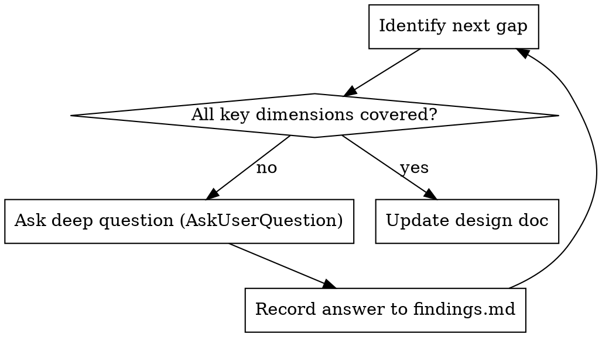

# Spec Interview

Refine draft specs and design docs into complete technical documents through deep, probing questions.

## When This Runs

- **When another skill invokes it** (e.g. brainstorming, which has already asked whether to run the interview): proceed directly with the refinement. The caller owns the opt-in gate, so do not re-ask "run the interview now?"
- **Manually** when user says "help me refine this plan/spec" or "ask me about the project"
- When a draft spec or plan.md is missing critical details

## The Process

```
Read target doc → Identify gaps → Ask deep questions (AskUserQuestion) → Iterate → Update doc
```

### Step 0: Check Preconditions

The interview needs a real draft to probe. Before anything else, locate the target doc and branch:

- **Doc missing or empty**: do NOT fabricate a spec to interview against. Use `AskUserQuestion` to offer: option 1 "(Recommended) Point me at the draft file", option 2 "Brainstorm first to produce one", option 3 "Paste the rough idea and I'll draft, then interview". Stop until one is chosen.
- **Doc already complete** (no real gaps across the seven dimensions): say so plainly and exit; don't manufacture questions to justify running. Offer to proceed to implementation instead.
- **User declines to answer / gives no useful input**: record the gap as an open question in the doc and move on rather than blocking.

Match the user's language (e.g. reply in Chinese to a Chinese trigger). Address the user directly: don't name this skill, its steps, or the tools you're using.

### Step 1: Read and Analyze

Read the design doc (from brainstorming) or user-specified document. Identify information gaps across these dimensions:

| Dimension | Focus Areas |
|-----------|-------------|
| Technical implementation | Data structures, algorithm choices, dependencies, interface design |
| Edge cases | Null values, concurrency, timeouts, extreme data volumes |
| Risk considerations | Security, performance bottlenecks, compatibility, maintenance cost |
| Trade-offs | Implementation complexity vs flexibility, performance vs readability |
| Architecture decisions | Module boundaries, dependency direction, extension points |
| Acceptance & testing | Acceptance criteria, test strategy, coverage expectations |
| Operability | Observability, logging, migration/rollback strategy |

### Step 2: Deep Questioning

Use the `AskUserQuestion` tool for ALL questions. Never ask questions in plain text.

**Questioning principles:**
- Ask deep questions, not obvious ones
- 1-2 related questions per round (use AskUserQuestion's multi-question support)
- Follow up on vague answers until you get concrete details
- Proactively raise scenarios the user may not have considered
- For every question, lead with your recommended answer (as the first AskUserQuestion option, marked "(Recommended)") plus the rationale, so the user confirms or rejects rather than starts from scratch
- If a question can be answered by exploring the codebase or existing docs, explore it yourself first; only ask the user about things you genuinely cannot determine

**Question types:**
```
Tech choice:    Why X over Y? Have you evaluated Z?
Edge handling:  When [extreme case] happens, what's the expected behavior?
Trade-off:      If you must choose between [A] and [B], which takes priority?
Dependency:     How tightly does this depend on [component X]?
Fallback:       If [assumption] doesn't hold, what's the backup plan?
```

### Step 3: Iterate Until Complete



### Step 4: Update Document

After the interview is complete, integrate all clarifications back into the original document:
- Preserve existing structure, fill in missing details
- Annotate key decisions with their rationale
- List identified risks and mitigations
- Also persist key findings (rejected alternatives, risk assessments, non-obvious decisions) to `.planning/findings.md`
- Record domain terms resolved during the interview in the repo-root `CONTEXT.md` (`superpower-planning:domain-glossary`)

**Confirmation gate (required before any commit).** Updating the doc and committing are mutating actions, never auto-commit. After writing the edits, summarize the changes and use `AskUserQuestion` to confirm before running git: option 1 "(Recommended) Commit the updated doc", option 2 "Show me the diff first", option 3 "Don't commit, leave it staged". Only run `git commit` if the user picks option 1.

## When Done

Refinement is complete once the target doc reflects the answers and the confirmation gate above is resolved.

- **Invoked by another skill:** hand control back to the caller and let it drive what comes next. Do NOT start implementation or write an implementation plan from here; that belongs to the calling flow.
- **Invoked standalone:** end after the document is updated (and committed, if the user approved the commit).
