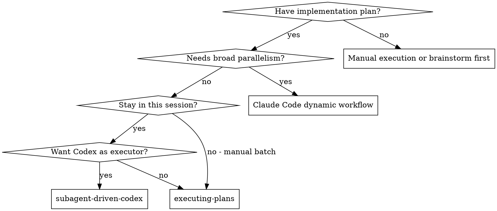
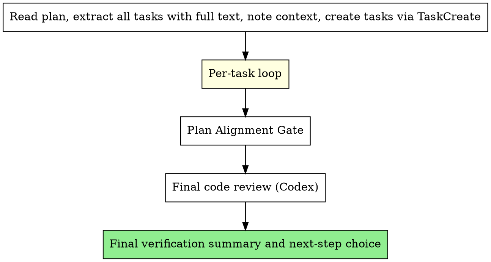

# Subagent-Driven Development (Codex Variant)

Execute a plan by dispatching every role — implementer, spec reviewer, quality reviewer — to **Codex CLI via the bridge script**. The orchestrator (you) stays in this session, plans tasks, ferries context between Codex sessions, and gates progress on a Codex-specific two-stage review.

**Core principle:** One Codex SESSION_ID per role per task + per-agent planning dir + two-stage review (spec then quality) = high-quality delegation to a second model, all from a single Claude session.

**Announce at start:** "I'm using the subagent-driven-codex skill — every implementer and reviewer dispatch will go to Codex via the bridge."

## Why This Exists

This skill is retained because it uses an external Codex CLI executor/reviewer path. For Claude-native high-parallelism work, prefer Claude Code dynamic workflows instead of rebuilding orchestration in plugin skills.

Use this variant when:
- You want a second model's eyes on every line of generated code without you reviewing each diff manually.
- The work is bounded and verifiable from disk (Codex's sweet spot per the user's collaboration policy).
- You want fresh, isolated executor context per role without spending Claude dynamic-workflow worker budget.
- You want the orchestrator's conversation context kept clean — the bridge runs in the background and only returns the final reply.

Prefer a Claude Code dynamic workflow when the task needs many Claude agents, broad parallel review, large migrations, or cross-checked research. Codex CLI does support MCP if the user has it configured — that is not a reason to avoid Codex.

## Hard Requirements (Non-Negotiable)

<EXTREMELY-IMPORTANT>
1. **Every `codex_bridge.py` invocation MUST be `run_in_background: true`.** Bridge calls block 60–120s. Foreground calls freeze the whole session. No exceptions.
2. **Pass `--cd <absolute-workspace-path>` on every call.** Codex runs from that root.
3. **Render `${CLAUDE_PLUGIN_ROOT}` to its absolute value before writing any prompt to disk.** Codex does NOT inherit a meaningful `CLAUDE_PLUGIN_ROOT` and does NOT auto-expand `${...}` placeholders — verified by experiment, the variable comes through as an empty string and the path lookup fails. See "Render Step" below.
4. **Capture base git SHA before dispatching the implementer.** Reviewers need the diff range. See "Per-task loop" step 1.
5. **Capture `SESSION_ID` from the first call to each role.** Reuse it on follow-up calls so Codex keeps context across fix-rounds within the SAME task. The SESSION_ID is per-task; it gets overwritten when the next task starts. Store IDs in `.planning/agents/<role>/session.txt`.
6. **Do NOT pass `--model` or `--profile`** unless the user explicitly named one. Reserved for user direction.
7. **Two-stage Codex review is still mandatory** (spec, then quality). Three round cap per stage.
8. **Verify Codex's output yourself before declaring the task done.** Codex's summary describes intent, not proof — read the diff, run the test, check the output.
9. **A reviewer Codex that modifies files invalidates its own review.** The bridge defaults to `danger-full-access`, so review prompts can only restrain Codex through wording. If a reviewer touches the workspace, discard the review, revert the unauthorized edits, and re-dispatch a fresh reviewer session with stronger language.
</EXTREMELY-IMPORTANT>

## Render Step (Mandatory)

Before passing any prompt body to `codex_bridge.py`, the orchestrator MUST resolve `${CLAUDE_PLUGIN_ROOT}` to an absolute path and substitute every occurrence in the rendered prompt.

```bash
# In the orchestrator's shell (Claude side):
PLUGIN_ROOT="$(realpath "${CLAUDE_PLUGIN_ROOT:-/path/to/superpower-planning}")"

# Render template → final prompt with absolute paths:
sed "s|\${CLAUDE_PLUGIN_ROOT}|${PLUGIN_ROOT}|g" /tmp/codex_<role>_<task>.tpl \
  > /tmp/codex_<role>_<task>.txt
```

If `CLAUDE_PLUGIN_ROOT` is not set in the orchestrator shell either, fall back to the plugin's installed path (commonly `~/.claude/plugins/cache/superpower-planning/superpower-planning/<version>/` or wherever this skill file itself lives — `dirname` from this `SKILL.md`'s known-good path is reliable).

**Empirical evidence:** a probe asking Codex to read `${CLAUDE_PLUGIN_ROOT}/skills/.../findings.md` returned `cat: 'No such file or directory'` and `CLAUDE_PLUGIN_ROOT=''`. Codex treats the placeholder as literal text.

## Two-Stage Review Gate

Every task MUST pass two independent Codex reviews before it can be marked complete:

1. **Spec Compliance Review** — dispatch via `./spec-reviewer-prompt.md`
2. **Code Quality Review** — dispatch via `./quality-reviewer-prompt.md` (only after spec review passes)

A task is NOT complete until BOTH reviews return APPROVED. The Task Status Dashboard in `.planning/progress.md` has `Spec Review`, `Quality Review`, and `Plan Align` columns. All three MUST show `PASS` before status can be `complete`.

## Review Loop Caps

Each review loop is capped at **3 fix-review rounds** per task.

The initial review does not count as a round. A "round" is one fix-then-re-review cycle: initial review → fix → re-review (round 1) → fix → re-review (round 2) → fix → re-review (round 3) → STOP.

After 3 rounds without approval, STOP and escalate to the user with:
1. Unresolved issues
2. Per-round summary of what was attempted
3. Choice: override and approve, give targeted guidance, or abort the task

Track round count in the Task Status Dashboard (e.g. `FAIL (round 2/3)`).

## When to Use



## Per-Agent Planning Directories

Each role gets ONE directory, reused across all tasks:

```bash
mkdir -p .planning/agents/implementer/
mkdir -p .planning/agents/spec-reviewer/
mkdir -p .planning/agents/quality-reviewer/
```

Each directory contains:
- `findings.md` — discoveries, decisions, critical items (appended **across tasks**)
- `progress.md` — step-by-step progress log (appended **across tasks**)
- `session.txt` — current Codex SESSION_ID for this role for the **current task only** (overwritten when the next task starts)
- `base_sha_taskN.txt` — git HEAD captured before the implementer ran (one file per task; reviewers need it for diff)

`findings.md` and `progress.md` are role-persistent: the same Codex implementer keeps appending what it learned across all tasks. `session.txt` is per-task: each new task gets a fresh Codex SESSION_ID for each role, written by the first dispatch of that role for that task and reused only for fix-rounds within the same task.

## Reviewer Session Strategy: Sticky vs. Fresh

This skill defaults to **sticky** reviewers: the spec reviewer and quality reviewer for a given task keep the same SESSION_ID across re-review rounds.

Pick deliberately:

- **Sticky (default here)** — the reviewer remembers exactly which issues it raised in round 1 and can verify resolution surgically. Round 2 is faster and cheaper. Risk: anchoring bias — the reviewer may stop looking at parts of the code it already approved.
- **Fresh** — every re-review starts from zero, no SESSION_ID reuse. Higher independence and surface coverage. Risk: round 2 may flag issues the reviewer in round 1 implicitly accepted, which produces inconsistency rather than convergence.

To switch a reviewer to fresh mode for a particular task, simply do not write its SESSION_ID to `session.txt` and dispatch each round as an initial call. Note the choice in `.planning/progress.md` so the user can see which mode was used.

## Plan Anchoring: How to Extract Tasks

When extracting tasks from `plan.md` to dispatch to Codex:

1. **Copy verbatim** — use exact text from `plan.md`, no paraphrase or summary
2. **Include the section reference** — tell Codex which section header in `plan.md` contains this task (e.g. `### Task 3: Recovery modes`)
3. **Include cross-task constraints** — global constraints (shared interfaces, naming conventions, perf requirements) go in the context section
4. **Pass plan file paths** — always include `.planning/plan.md` and `.planning/design.md` so Codex can cross-reference originals

Verbatim copying + plan references let Codex and reviewers verify against the source of truth.

## Bridge Invocation Cheatsheet

The orchestrator's shell is responsible for resolving `${CLAUDE_PLUGIN_ROOT}` (see Render Step). Below, `${PLUGIN_ROOT}` is the already-resolved absolute path. `${WORKSPACE}` is the absolute workspace path. `${SLUG}` is a per-task stable slug used to namespace `/tmp` files. Recommended value: `"$(basename "${WORKSPACE}")"`. Do NOT use `$$` (the bash PID) — every Bash tool call is a fresh shell with a different PID, so a PID-based SLUG would not match between dispatch and fix-round. If you genuinely need cross-worktree disambiguation, persist the slug to `.planning/agents/slug.txt` once at task start and read it back on every dispatch.

**Initial dispatch (any role) — capture SESSION_ID from output:**

```bash
python3 "${PLUGIN_ROOT}/skills/collaborating-with-codex/scripts/codex_bridge.py" \
  --cd "${WORKSPACE}" \
  --PROMPT "$(cat /tmp/codex_${SLUG}_<role>_<task>.txt)" \
  > /tmp/codex_${SLUG}_<role>_<task>.json 2>&1 &
```

Required: `run_in_background: true` on the Bash call. Read the `.json` after the bridge returns and extract `SESSION_ID` and `agent_messages`.

**Follow-up (fix-round, re-review, etc.):**

```bash
python3 "${PLUGIN_ROOT}/skills/collaborating-with-codex/scripts/codex_bridge.py" \
  --cd "${WORKSPACE}" \
  --SESSION_ID "$(cat .planning/agents/<role>/session.txt)" \
  --PROMPT "$(cat /tmp/codex_${SLUG}_<role>_<task>_round<N>.txt)" \
  > /tmp/codex_${SLUG}_<role>_<task>_round<N>.json 2>&1 &
```

**Non-git workspace:** add `--skip-git-repo-check` if `${WORKSPACE}` isn't a git repository. Most plan-driven runs are git-tracked, so this flag is rarely needed.

**Heavy debug trace (rare — when reasoning steps matter):** add `--return-all-messages`.

**Sandbox:** the bridge defaults to `danger-full-access`. `--sandbox read-only` is rejected by the bridge, and `workspace-write` silently downgrades on hosts without bubblewrap (Ubuntu 24.04+ commonly fails the bwrap probe). The practical effect is that **every reviewer Codex has filesystem write access**. Restrict review behavior through the prompt body ("do not modify files; return findings only"). Treat any modification by a reviewer as a review-invalidating event — see Hard Requirement #9.

## Smoke Test (Before First Real Dispatch)

After installing the plugin, verify the bridge actually runs from this skill's path before sending a real implementer task. From the orchestrator shell:

```bash
PLUGIN_ROOT="$(realpath "${CLAUDE_PLUGIN_ROOT}")"
python3 "${PLUGIN_ROOT}/skills/collaborating-with-codex/scripts/codex_bridge.py" \
  --cd "$(pwd)" \
  --skip-git-repo-check \
  --PROMPT "Reply with the literal string 'codex bridge ok' and nothing else." \
  > /tmp/codex_smoke.json 2>&1 &
# (run in background, then check /tmp/codex_smoke.json for success: true and the literal reply)
```

If the smoke test fails, fix the bridge or auth before dispatching real tasks — review loops are far harder to diagnose mid-flight.

## The Process



**Per-task loop (every task runs through this):**

1. **Capture baseline:** ensure `.planning/agents/{implementer,spec-reviewer,quality-reviewer}/` exist. Record current git HEAD as the task's base SHA: `git -C "${WORKSPACE}" rev-parse HEAD > .planning/agents/base_sha_taskN.txt`. Reviewers will use this to scope their `git diff` to this task only.
2. **Render the implementer prompt:** start from `./implementer-prompt.md`, fill in placeholders (`{{N}}`, `{{task_name}}`, `{{FULL_TEXT_OF_TASK}}`, etc.), THEN run the Render Step (substitute `${CLAUDE_PLUGIN_ROOT}` with the absolute plugin root). Write the final body to `/tmp/codex_${SLUG}_implementer_taskN.txt`.
3. **Dispatch implementer** via `codex_bridge.py` (background). Capture `SESSION_ID` from the JSON output and write it to `.planning/agents/implementer/session.txt`.
4. **Read Codex's reply** from `/tmp/codex_${SLUG}_implementer_taskN.json`.
5. **Clarifications:** if Codex asks clarifying questions, render a short follow-up prompt body, run the Render Step, and dispatch a follow-up bridge call reusing the SESSION_ID.
6. **Sanity-check:** when implementer reports done, read `git diff $(cat .planning/agents/base_sha_taskN.txt)..HEAD` yourself and confirm the changes look reasonable before invoking reviewers.
7. **Capture head SHA:** `git -C "${WORKSPACE}" rev-parse HEAD > .planning/agents/head_sha_taskN.txt`. Pass both base and head into reviewer prompts.
8. **Render and dispatch spec reviewer** from `./spec-reviewer-prompt.md` (fresh Codex session — new SESSION_ID stored in `.planning/agents/spec-reviewer/session.txt`). Run the Render Step before writing the prompt body.
9. **Spec fix loop:** if issues found, render a fix prompt for the implementer, dispatch on the implementer's SESSION_ID. After implementer reports fix + new commit, re-render the spec reviewer's re-review prompt and dispatch reusing the spec reviewer's SESSION_ID (sticky mode — see Reviewer Session Strategy). Max 3 rounds.
10. **Render and dispatch quality reviewer** from `./quality-reviewer-prompt.md` once spec PASSes (fresh Codex session, new SESSION_ID in `.planning/agents/quality-reviewer/session.txt`).
11. **Quality fix loop:** same shape as step 9, sticky reviewer SESSION_ID, max 3 rounds.
12. **Aggregate and complete:** run `aggregate-agent-findings.sh` for each role, update Task Status Dashboard, mark task complete via TaskUpdate.

**After all tasks:** Plan Alignment Gate (re-read `plan.md`/`design.md`, check for cumulative drift), then a final whole-implementation Codex review, then run the plan's final verification commands and ask the user whether to archive, prepare a PR, keep the branch, or do something else.

## Orchestrator Aggregation Flow

After each task passes both reviews, aggregate Codex's findings:

```bash
${CLAUDE_PLUGIN_ROOT}/scripts/aggregate-agent-findings.sh "<role>" "Task N: <name>"
```

This extracts "Critical for Orchestrator" items from each role's `findings.md` and appends them to top-level `.planning/findings.md` and `.planning/progress.md`. Then manually:
- Update the Task Status Dashboard table at the top
- Append completion details to the session log

Example aggregation:

```markdown
<!-- .planning/findings.md -->
## Task 2: Recovery modes (Codex-driven)
- [From implementer/codex] Database migration requires careful ordering
- [From spec-reviewer/codex] All requirements met after fix pass
- [From quality-reviewer/codex] Approved with no issues

<!-- .planning/progress.md Task Status Dashboard -->
| Task 1: Hook installation | ✅ complete | PASS | PASS | PASS | agents/implementer/ | 5 tests passing (codex) |
| Task 2: Recovery modes    | ✅ complete | PASS (2nd pass) | PASS | PASS | agents/implementer/ | 8 tests passing (codex) |
| Task 3: Config parser     | ⏳ pending  | -    | -    | -    | -                   | -                       |
```

## Prompt Templates

- `./implementer-prompt.md` — body fed to Codex for implementation work (initial + fix-rounds)
- `./spec-reviewer-prompt.md` — body fed to Codex for spec compliance review (initial + re-reviews)
- `./quality-reviewer-prompt.md` — body fed to Codex for code quality review (initial + re-reviews)

Each template explains exactly what to render, where Codex's output lands, and how to feed follow-up rounds.

## Codex-Specific Adjustments

Operational differences from Claude-native workflows:

| Concern | Claude-native workflow | subagent-driven-codex |
|---------|--------------------------|------------------------|
| Dispatch | Claude Code workflow runtime | `codex_bridge.py` background bash |
| Tooling inside worker | Claude Code subagent tools | Codex CLI's native tools — no Skill tool, no Claude Agent fork. MCP works if configured for Codex. |
| Reading plugin instructions | Workflow prompt and repo files | Prompt must substitute `${CLAUDE_PLUGIN_ROOT}` with the absolute path before sending; Codex treats placeholders literally. See Render Step. |
| Multi-turn within a task | Workflow script state | Same Codex SESSION_ID re-used per task; overwritten when the next task starts |
| Asking the orchestrator a question | Workflow/subagent result | Codex `agent_messages` text — read it and follow up via SESSION_ID |
| "Critical for orchestrator" markers | Workflow report or file writes | Codex writes to the same `findings.md` paths because it can edit files |
| Cost model | Claude usage | OpenAI Codex usage |

## Example Workflow

```
You: I'm using subagent-driven-codex to execute this plan.

[Read .planning/plan.md once, extract all 5 tasks verbatim, TaskCreate]
[Resolve PLUGIN_ROOT="$(realpath "${CLAUDE_PLUGIN_ROOT}")"]
[Set WORKSPACE="<absolute workspace path>", SLUG="$(basename "${WORKSPACE}")"]
[Run smoke test once before the first real dispatch]

Task 1: Hook installation script

[mkdir -p .planning/agents/{implementer,spec-reviewer,quality-reviewer}]
[Capture base SHA: git -C "${WORKSPACE}" rev-parse HEAD > .planning/agents/base_sha_task1.txt]

[Render: fill placeholders in ./implementer-prompt.md → write implementer-task1.tpl
 then sed-substitute ${CLAUDE_PLUGIN_ROOT} → /tmp/codex_${SLUG}_implementer_task1.txt]
[Verify: grep '\${CLAUDE_PLUGIN_ROOT}' /tmp/codex_${SLUG}_implementer_task1.txt is empty]

[Dispatch implementer in background:
   python3 "${PLUGIN_ROOT}/skills/collaborating-with-codex/scripts/codex_bridge.py" \
     --cd "${WORKSPACE}" \
     --PROMPT "$(cat /tmp/codex_${SLUG}_implementer_task1.txt)" \
     > /tmp/codex_${SLUG}_implementer_task1.json 2>&1 &]

[After notification: parse JSON; write SESSION_ID to .planning/agents/implementer/session.txt]

Codex (implementer): "Before I begin — should the hook be installed at user or system level?"

You: "User level (~/.config/superpowers/hooks/)."

[Render follow-up prompt → /tmp/codex_${SLUG}_implementer_task1_round1.txt]
[Dispatch with --SESSION_ID "$(cat .planning/agents/implementer/session.txt)" in background]

Codex: "Got it. Implementing now…"
[Codex edits files, runs tests, commits sha abcd123]
Codex final reply: Implemented, 5/5 tests pass, self-review caught --force flag, logged to findings.md.

[Verify: git diff "$(cat .planning/agents/base_sha_task1.txt)"..HEAD, run tests yourself]
[Capture head SHA: git -C "${WORKSPACE}" rev-parse HEAD > .planning/agents/head_sha_task1.txt]

[Render spec reviewer prompt with base_sha and head_sha filled in →
 /tmp/codex_${SLUG}_specrev_task1.txt (run sed substitution as before)]
[Dispatch fresh Codex session; capture SESSION_ID into .planning/agents/spec-reviewer/session.txt]

Codex (spec reviewer): Verdict PASS — spec compliant.

[Render quality reviewer prompt → /tmp/codex_${SLUG}_qualrev_task1.txt]
[Dispatch fresh Codex session; capture SESSION_ID into .planning/agents/quality-reviewer/session.txt]

Codex (quality reviewer): Verdict APPROVED.

[Run aggregate-agent-findings.sh implementer "Task 1: Hook installation"]
[Run aggregate-agent-findings.sh spec-reviewer "Task 1: Hook installation"]
[Run aggregate-agent-findings.sh quality-reviewer "Task 1: Hook installation"]
[TaskUpdate Task 1 → completed]

Task 2: Recovery modes
[Capture fresh base SHA into .planning/agents/base_sha_task2.txt]
[session.txt for each role gets overwritten with the new task's SESSION_IDs]
[Same flow — but spec reviewer finds 2 issues; render fix prompt, dispatch on
 implementer's SESSION_ID; then re-render reviewer round1 prompt and dispatch
 on spec-reviewer's SESSION_ID (sticky). Max 3 rounds.]
…
```

## Advantages

**vs. Claude Code dynamic workflows:**
- Uses Codex as an external second model for both implementation and review.
- Keeps Claude context small: bridge runs in background, only the final reply lands in conversation.
- Useful for bounded serial work where second-model independence matters more than large-scale parallelism.

**vs. executing-plans (manual batch session):**
- Same session, no handoff.
- Continuous progress, no waiting for human checkpoints between batches.

**Quality gates:**
- Self-review inside Codex catches issues before reporting back.
- Two-stage external review (spec, then quality), each in a fresh Codex SESSION_ID for independence.
- 3-round cap forces escalation rather than infinite loops.
- Plan Alignment Gate after all tasks catches cumulative drift.

## Costs

- More bridge invocations per task (implementer + 2 reviewers, plus fix rounds).
- Codex spend instead of Claude usage — track per-task by saving `agent_messages` size and SESSION_IDs.
- Orchestrator does more prep work (extracting all tasks upfront, rendering prompts, reading JSON outputs).
- Lower interactivity than direct Claude execution — Codex is asynchronous; round-trips cost ~60–120s each.

## Red Flags

**Never:**
- Run `codex_bridge.py` in the foreground (freezes session — see Hard Requirements).
- Skip reviews. No exceptions.
- Start implementation on `main`/`master` without explicit user consent.
- Dispatch multiple implementer Codex sessions in parallel for related tasks (file conflicts).
- Make Codex read `plan.md` blind — provide full task text in the prompt and reference the path for cross-check.
- Skip planning-dir creation or aggregation step (knowledge gets lost).
- Trust Codex's "all done" report without verifying the diff and running the tests yourself.
- Pass `--model` or `--profile` unless the user explicitly named one.

**If Codex asks questions:**
- Answer via follow-up call to the same SESSION_ID. Provide additional context if needed. Don't proceed until Codex confirms.

**If reviewer Codex finds issues:**
- Send fix instructions to the implementer's SESSION_ID (not a fresh session — keeps the implementation context).
- Re-dispatch the reviewer reusing its SESSION_ID.
- Max 3 fix-review rounds. After that, escalate.

**If a Codex run fails (exit non-zero, JSON `success: false`):**
- Read the error message from the JSON output.
- Common causes: network timeout, missing API key, sandbox bwrap probe failure.
- Retry once with the same SESSION_ID. If it still fails, escalate.

**If a reviewer modifies files (Hard Requirement #9):**
- Treat the review verdict as void regardless of what it said.
- `git stash` or revert the unauthorized changes (`git checkout -- <paths>`) so the workspace returns to the implementer's last sanctioned commit.
- Discard that reviewer SESSION_ID and dispatch a fresh review with stronger language ("you may NOT use any tool that writes to disk; respond with text only").
- Note the incident in `.planning/findings.md` so the user can audit later.

## Integration

**Required related skills:**
- `superpower-planning:collaborating-with-codex` — provides the bridge script. This skill cannot work without it.
- `superpower-planning:git-worktrees` — RECOMMENDED: set up isolated workspace unless already on a feature branch (Codex commits into the workspace it sees).
- `superpower-planning:writing-plans` — creates the plan this skill executes.
- `superpower-planning:requesting-review` — code review template referenced by reviewer prompts.

**Codex follows internally:**
- The implementer prompt instructs Codex to follow TDD when the task says to.

**Alternative workflows:**
- Claude Code dynamic workflows — preferred for large parallel work, migrations, and cross-checked audits.
- `superpower-planning:executing-plans` — manual batch execution with checkpoints.
