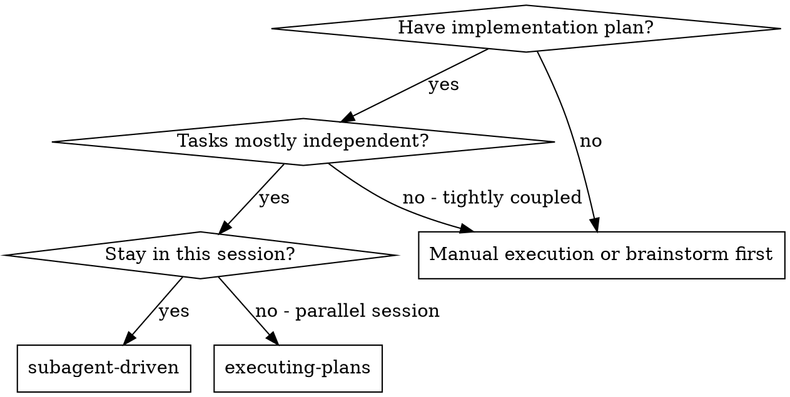
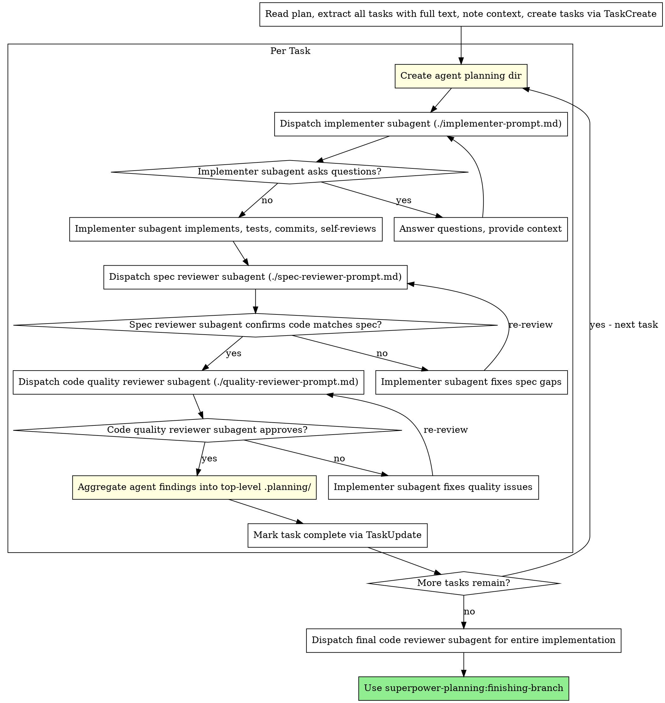

# Subagent-Driven Development

Execute plan by dispatching fresh subagent per task, with two-stage review after each: spec compliance review first, then code quality review. Each subagent gets its own planning directory for structured knowledge capture.

**Core principle:** Fresh subagent per task + per-agent planning dir + two-stage review (spec then quality) = high quality, fast iteration

## When to Use



**vs. Executing Plans (parallel session):**
- Same session (no context switch)
- Fresh subagent per task (no context pollution)
- Per-agent planning directories (structured knowledge capture)
- Two-stage review after each task: spec compliance first, then code quality
- Faster iteration (no human-in-loop between tasks)

## The Process



## Per-Agent Planning Directories

Before dispatching each implementer subagent, create its planning directory:

```bash
mkdir -p .planning/agents/{role}-task-{N}/
```

Example for Task 2 implementer:
```bash
mkdir -p .planning/agents/implementer-task-2/
```

Each agent planning dir contains:
- `findings.md` - Discoveries, decisions, critical items
- `progress.md` - Step-by-step progress log

Include the planning dir path in the agent's prompt using `./implementer-prompt.md` template.

## Orchestrator Aggregation Flow

After each task completes (both reviews pass), aggregate the agent's findings:

1. **Read** the agent's `.planning/agents/{role}-task-{N}/findings.md` and `progress.md`
2. **Extract** items marked with `> **Critical for Orchestrator:**` plus any errors and test results
3. **Append** extracted items to top-level `.planning/findings.md` under a task heading
4. **Update** top-level `.planning/progress.md`:
   - **Update the Task Status Dashboard table** at the top (add/update the row for this task)
   - **Append** completion details to the session log section

Example aggregation:
```markdown
<!-- Append to .planning/findings.md -->
## Task 2: Recovery modes
- [From implementer] Database migration requires careful ordering
- [From spec-reviewer] All requirements met after fix pass
- [From quality-reviewer] Approved with no issues

<!-- Update Task Status Dashboard table in .planning/progress.md -->
| Task 1: Hook installation | ✅ complete | agents/implementer-task-1/ | 5 tests passing |
| Task 2: Recovery modes | ✅ complete | agents/implementer-task-2/ | 8 tests passing |
| Task 3: Config parser | ⏳ pending | - | - |

<!-- Append to session log in .planning/progress.md -->
- [x] Task 2: Recovery modes - COMPLETED
  - Implementer: 8 tests passing, committed
  - Spec review: Passed (2nd pass after fix)
  - Quality review: Approved
```

## Prompt Templates

- `./implementer-prompt.md` - Dispatch implementer subagent (includes planning dir injection)
- `./spec-reviewer-prompt.md` - Dispatch spec compliance reviewer subagent
- `./quality-reviewer-prompt.md` - Dispatch code quality reviewer subagent

## Example Workflow

```
You: I'm using Subagent-Driven Development to execute this plan.

[Read plan file once: docs/plans/feature-plan.md]
[Extract all 5 tasks with full text and context]
[Create all tasks via TaskCreate]

Task 1: Hook installation script

[Create .planning/agents/implementer-task-1/]
[Dispatch implementation subagent with full task text + context + planning dir]

Implementer: "Before I begin - should the hook be installed at user or system level?"

You: "User level (~/.config/superpowers/hooks/)"

Implementer: "Got it. Implementing now..."
[Later] Implementer:
  - Implemented install-hook command
  - Added tests, 5/5 passing
  - Self-review: Found I missed --force flag, added it
  - Committed
  - Logged findings to .planning/agents/implementer-task-1/findings.md

[Dispatch spec compliance reviewer with its own planning dir]
Spec reviewer: Spec compliant - all requirements met, nothing extra

[Get git SHAs, dispatch code quality reviewer]
Code reviewer: Strengths: Good test coverage, clean. Issues: None. Approved.

[Aggregate: read agent findings, append to .planning/findings.md and progress.md]
[Mark Task 1 complete]

Task 2: Recovery modes

[Create .planning/agents/implementer-task-2/]
[Dispatch implementation subagent with full task text + context + planning dir]

Implementer: [No questions, proceeds]
Implementer:
  - Added verify/repair modes
  - 8/8 tests passing
  - Self-review: All good
  - Committed

[Dispatch spec compliance reviewer]
Spec reviewer: Issues:
  - Missing: Progress reporting (spec says "report every 100 items")
  - Extra: Added --json flag (not requested)

[Implementer fixes issues]
Implementer: Removed --json flag, added progress reporting

[Spec reviewer reviews again]
Spec reviewer: Spec compliant now

[Dispatch code quality reviewer]
Code reviewer: Strengths: Solid. Issues (Important): Magic number (100)

[Implementer fixes]
Implementer: Extracted PROGRESS_INTERVAL constant

[Code reviewer reviews again]
Code reviewer: Approved

[Aggregate agent findings into .planning/]
[Mark Task 2 complete]

...

[After all tasks]
[Dispatch final code-reviewer]
Final reviewer: All requirements met, ready to merge

Done!
```

## Advantages

**vs. Manual execution:**
- Subagents follow TDD naturally
- Fresh context per task (no confusion)
- Parallel-safe (subagents don't interfere)
- Subagent can ask questions (before AND during work)
- Per-agent planning dirs capture knowledge persistently

**vs. Executing Plans:**
- Same session (no handoff)
- Continuous progress (no waiting)
- Review checkpoints automatic

**Efficiency gains:**
- No file reading overhead (controller provides full text)
- Controller curates exactly what context is needed
- Subagent gets complete information upfront
- Questions surfaced before work begins (not after)
- Planning dirs prevent knowledge loss between subagents

**Quality gates:**
- Self-review catches issues before handoff
- Two-stage review: spec compliance, then code quality
- Review loops ensure fixes actually work
- Spec compliance prevents over/under-building
- Code quality ensures implementation is well-built
- Aggregation preserves findings for future tasks

**Cost:**
- More subagent invocations (implementer + 2 reviewers per task)
- Controller does more prep work (extracting all tasks upfront)
- Review loops add iterations
- But catches issues early (cheaper than debugging later)

## Red Flags

**Never:**
- Start implementation on main/master branch without explicit user consent
- Skip reviews (spec compliance OR code quality)
- Proceed with unfixed issues
- Dispatch multiple implementation subagents in parallel (conflicts)
- Make subagent read plan file (provide full text instead)
- Skip scene-setting context (subagent needs to understand where task fits)
- Ignore subagent questions (answer before letting them proceed)
- Accept "close enough" on spec compliance (spec reviewer found issues = not done)
- Skip review loops (reviewer found issues = implementer fixes = review again)
- Let implementer self-review replace actual review (both are needed)
- **Start code quality review before spec compliance is passed** (wrong order)
- Move to next task while either review has open issues
- Skip planning dir creation (agents need structured output)
- Skip aggregation step (knowledge gets lost between tasks)

**If subagent asks questions:**
- Answer clearly and completely
- Provide additional context if needed
- Don't rush them into implementation

**If reviewer finds issues:**
- Implementer (same subagent) fixes them
- Reviewer reviews again
- Repeat until approved
- Don't skip the re-review

**If subagent fails task:**
- Dispatch fix subagent with specific instructions
- Don't try to fix manually (context pollution)

## Integration

**Required workflow skills:**
- **superpower-planning:git-worktrees** - REQUIRED: Set up isolated workspace before starting
- **superpower-planning:writing-plans** - Creates the plan this skill executes
- **superpower-planning:requesting-review** - Code review template for reviewer subagents
- **superpower-planning:finishing-branch** - Complete development after all tasks

**Subagents should use:**
- **superpower-planning:tdd** - Subagents follow TDD for each task

**Alternative workflow:**
- **superpower-planning:executing-plans** - Use for parallel session instead of same-session execution
