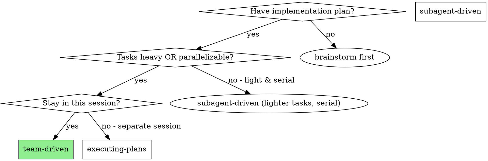
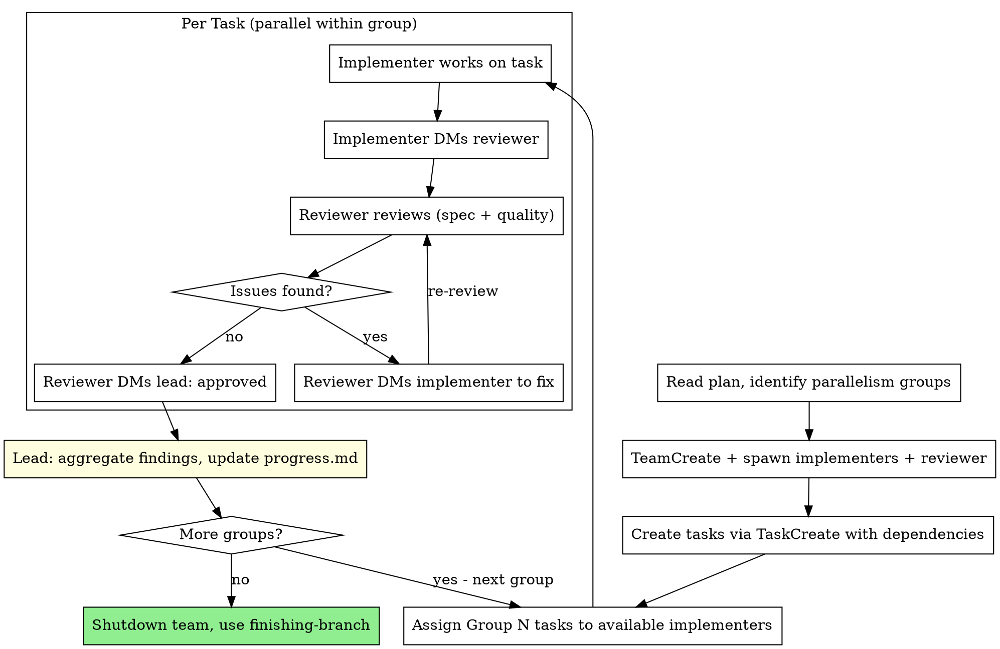

# Team-Driven Development

Execute plan by creating an Agent Team with persistent implementer teammates and a dedicated reviewer. Teammates work in parallel on independent tasks, with the reviewer providing continuous quality gates.

**Core principle:** Persistent teammates + parallel execution + dedicated reviewer = high throughput, context resilience, quality assurance

**Announce at start:** "I'm using the team-driven skill to execute this plan with an Agent Team."

## When to Use



**Two independent advantages over subagent-driven:**

1. **Parallelism** — Independent tasks execute simultaneously across multiple implementers
2. **Context resilience** — Each teammate has its own full context window. Subagents share the parent's context limit and can crash on heavy tasks. Teammates don't have this problem.

**Even without parallelism, team-driven is preferred for heavy tasks** where a single subagent might hit context limits.

## Team Structure

```
Team Lead (you, current session)
├── implementer-1 (teammate)  ──→ Task A ─┐
├── implementer-2 (teammate)  ──→ Task B ──┤── parallel
├── implementer-N (teammate)  ──→ Task C ─┘
└── reviewer (teammate)       ──→ reviews completed tasks
```

- **Team lead:** Reads plan, creates tasks, assigns work, aggregates findings, updates progress.md
- **Implementers:** Persistent teammates, each works on assigned tasks, DMs reviewer when done
- **Reviewer:** Dedicated teammate for spec compliance + code quality review. DMs implementer for fixes, DMs lead when approved.

## The Process



## Step-by-Step

### Step 1: Read Plan and Identify Parallelism

Read the plan file. Look for the `### Parallelism Groups` section:

```markdown
### Parallelism Groups
- **Group A** (parallel): Task 1, Task 2, Task 3
- **Group B** (after Group A): Task 4, Task 5
- **Group C** (after Group B): Task 6
```

If no parallelism groups are defined, treat each task as its own group (serial execution — still benefits from context resilience).

Determine `MAX_PARALLEL` = largest group size. This is the number of implementer teammates to spawn.

### Step 2: Create Team and Spawn Teammates

```
TeamCreate: team_name="plan-execution"

# Spawn implementers (one per max parallel slot)
Task(team_name="plan-execution", name="implementer-1", subagent_type="general-purpose")
Task(team_name="plan-execution", name="implementer-2", subagent_type="general-purpose")
...

# Spawn reviewer
Task(team_name="plan-execution", name="reviewer", subagent_type="general-purpose")
```

**Implementer teammate prompt:** Use `./implementer-teammate-prompt.md` template.

**Reviewer teammate prompt:** Use `./reviewer-teammate-prompt.md` template.

### Step 3: Create Tasks and Set Dependencies

Create all tasks via TaskCreate. Set `addBlockedBy` for tasks in later groups:

```
TaskCreate: "Task 1: ..." (Group A)
TaskCreate: "Task 2: ..." (Group A)
TaskCreate: "Task 3: ..." (Group A)
TaskCreate: "Task 4: ..." (Group B) → addBlockedBy: [1, 2, 3]
TaskCreate: "Task 5: ..." (Group B) → addBlockedBy: [1, 2, 3]
TaskCreate: "Task 6: ..." (Group C) → addBlockedBy: [4, 5]
```

### Step 4: Assign Tasks

For the current group, assign tasks to implementers:

```
TaskUpdate: taskId="1", owner="implementer-1"
TaskUpdate: taskId="2", owner="implementer-2"
TaskUpdate: taskId="3", owner="implementer-3"

SendMessage: type="message", recipient="implementer-1", content="Please work on Task 1: [full task text from plan]"
SendMessage: type="message", recipient="implementer-2", content="Please work on Task 2: [full task text from plan]"
...
```

**IMPORTANT:** Include the full task text in the message. Don't make teammates read the plan file.

### Step 5: Monitor and Aggregate

As teammates complete tasks:

1. **Reviewer approves** → lead receives DM notification
2. **Lead updates progress.md Dashboard** — mark task complete, note key outcome
3. **Lead reads agent planning dirs** — aggregate findings to top-level `.planning/findings.md`
4. **Lead assigns next tasks** if teammate is free and unblocked tasks exist

### Step 6: Shutdown

After all tasks complete:

1. Update `.planning/progress.md` with final status
2. Send shutdown requests to all teammates
3. **REQUIRED SUB-SKILL:** Use superpower-planning:finishing-branch

## Per-Agent Planning Directories

Each **persistent teammate** maintains a single planning directory across all tasks:

```bash
mkdir -p .planning/agents/implementer-1/
mkdir -p .planning/agents/implementer-2/
mkdir -p .planning/agents/reviewer/
```

Implementers update the same `findings.md` and `progress.md` as they work on successive tasks. This keeps context continuous rather than fragmented across per-task folders.

**Note:** This differs from subagent-driven, where each one-shot subagent gets a per-task dir (`implementer-task-N/`).

## Prompt Templates

- `./implementer-teammate-prompt.md` — Initial prompt for spawning implementer teammates
- `./reviewer-teammate-prompt.md` — Initial prompt for spawning the reviewer teammate

## Example Workflow

```
You: I'm using Team-Driven Development to execute this plan.

[Read plan: docs/plans/feature-plan.md]
[Identify groups: Group A (Tasks 1,2,3), Group B (Tasks 4,5), Group C (Task 6)]
[MAX_PARALLEL = 3]

[TeamCreate: "plan-execution"]
[Spawn: implementer-1, implementer-2, implementer-3, reviewer]
[Create all 6 tasks via TaskCreate with group dependencies]

=== Group A (parallel) ===

[Assign Task 1 → implementer-1, Task 2 → implementer-2, Task 3 → implementer-3]
[Send full task text to each implementer]

[implementer-1 working on Task 1...]
[implementer-2 working on Task 2...]
[implementer-3 working on Task 3...]

implementer-2 → reviewer: "Task 2 done. [report]"
reviewer → implementer-2: "Missing error handling for edge case X"
implementer-2: fixes issue
implementer-2 → reviewer: "Fixed. [updated report]"
reviewer → lead: "Task 2 approved"

implementer-1 → reviewer: "Task 1 done. [report]"
reviewer → lead: "Task 1 approved"

implementer-3 → reviewer: "Task 3 done. [report]"
reviewer → lead: "Task 3 approved"

[Lead: aggregate findings, update progress.md, unblock Group B]

=== Group B (parallel, after A) ===

[Assign Task 4 → implementer-1, Task 5 → implementer-2]
[implementer-3 is idle — can be shut down or held for Group C]

... same pattern ...

=== Group C ===

[Assign Task 6 → implementer-1]
... reviewer approves ...

[All tasks complete]
[Shutdown team]
[Use finishing-branch skill]
```

## vs Subagent-Driven

| Dimension | Subagent-Driven | Team-Driven |
|-----------|----------------|-------------|
| Parallelism | Serial only | Parallel within groups |
| Context lifetime | One-shot (dies after task) | Persistent (survives across tasks) |
| Context limit | Shares parent's limit | Own full context window |
| Review | New reviewer subagent per task | Persistent reviewer teammate |
| Communication | Through lead only | Peer DM (implementer ↔ reviewer) |
| Cost | Lower (serial execution) | Higher (parallel agents) |
| Best for | Light serial tasks | Heavy tasks, parallelizable work |

## Red Flags

**Never:**
- Assign two implementers to tasks that edit the same files
- Skip the reviewer for any task
- Let implementers communicate directly with each other (use lead as coordinator for cross-task concerns)
- Proceed to next group before current group is fully reviewed and approved
- Forget to aggregate findings from agent planning dirs

**If teammate goes idle:**
- Idle is normal — it means they're waiting for input
- Send them a message to wake them up with new work
- Don't treat idle as an error

**If teammate hits a blocker:**
- Teammate should DM lead describing the blocker
- Lead resolves (provide info, reassign, or escalate to user)
- Don't let blocked teammates spin

## Integration

**Required workflow skills:**
- **superpower-planning:git-worktrees** — RECOMMENDED: Set up isolated workspace unless already on a feature branch
- **superpower-planning:writing-plans** — Creates the plan with parallelism groups
- **superpower-planning:finishing-branch** — Complete development after all tasks

**Complementary skills:**
- **superpower-planning:verification** — Final verification before declaring done
