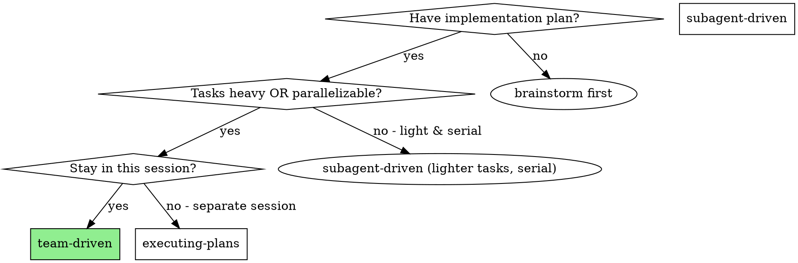
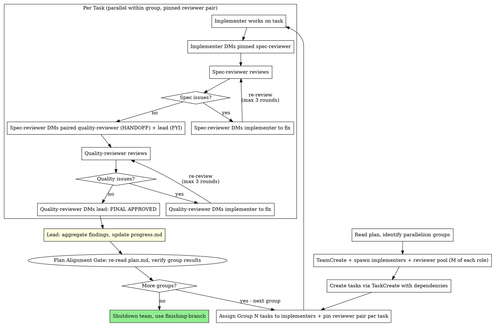

# Team-Driven Development

Execute plan by creating an Agent Team with persistent implementer teammates and dedicated spec and quality reviewers. Teammates work in parallel on independent tasks, with two-stage review providing continuous quality gates.

**Core principle:** Persistent teammates + parallel execution + two-stage review (spec then quality) = high throughput, context resilience, quality assurance

**Announce at start:** "I'm using the team-driven skill to execute this plan with an Agent Team."

## NON-NEGOTIABLE: Two-Stage Review Gate

<EXTREMELY-IMPORTANT>
Every task MUST pass TWO independent reviews before it can be marked complete:

1. **Spec Compliance Review** — spec-reviewer teammate verifies code matches the original plan
2. **Code Quality Review** — quality-reviewer teammate verifies code is well-built (only after spec review passes)

**A task is NOT complete until the quality-reviewer DMs the lead with `FINAL APPROVED Task N`.**

You MUST NOT:
- Skip either reviewer for ANY reason ("task was simple", "just a config change")
- Mark a task complete without BOTH reviewers approving
- Start quality review before spec review passes
- Proceed to the next parallelism group while any task has open review issues

The Task Status Dashboard in `.planning/progress.md` has `Spec Review`, `Quality Review`, and `Plan Align` columns.
A task row MUST show `PASS` in ALL THREE columns before you can set its status to `complete`.
</EXTREMELY-IMPORTANT>

## Review Loop Caps

Each review stage has its own cap of **3 fix-review rounds**.

**Round counting:** The initial review does not count as a round. A "round" is one fix-then-re-review cycle: initial review → DM implementer to fix → re-review (round 1) → DM fix → re-review (round 2) → DM fix → re-review (round 3) → STOP.

**After 3 rounds without approval, the reviewer MUST DM the team lead to escalate.** The escalation message should include:

1. What issues remain unresolved
2. What was attempted in each round
3. Whether the issues are getting better, worse, or stuck

**The team lead then escalates to the user** with three choices:
- **Override and approve** — accept the current state despite open issues
- **Provide guidance** — give specific direction for a targeted fix (does NOT reset the counter)
- **Abort the task** — stop work on this task entirely

**Track round count** in the Task Status Dashboard. Use notation like `FAIL (round 2/3)` in the review columns.

## When to Use


```dot
digraph when_to_use {
    "Have implementation plan?" [shape=diamond];
    "Tasks heavy OR parallelizable?" [shape=diamond];
    "Stay in this session?" [shape=diamond];
    "team-driven" [shape=box style=filled fillcolor=lightgreen];
    "subagent-driven" [shape=box];
    "executing-plans" [shape=box];

    "Have implementation plan?" -> "Tasks heavy OR parallelizable?" [label="yes"];
    "Have implementation plan?" -> "brainstorm first" [label="no"];
    "Tasks heavy OR parallelizable?" -> "Stay in this session?" [label="yes"];
    "Tasks heavy OR parallelizable?" -> "subagent-driven (lighter tasks, serial)" [label="no - light & serial"];
    "Stay in this session?" -> "team-driven" [label="yes"];
    "Stay in this session?" -> "executing-plans" [label="no - separate session"];
}
```

**Two independent advantages over subagent-driven:**

1. **Parallelism** — Independent tasks execute simultaneously across multiple implementers
2. **Context resilience** — Each teammate has its own full context window. Subagents share the parent's context limit and can crash on heavy tasks. Teammates don't have this problem.

**Even without parallelism, team-driven is preferred for heavy tasks** where a single subagent might hit context limits.

## Team Structure

```
Team Lead (you, current session)
├── implementer-1 (teammate)        ──→ pinned to reviewer pair 1 ─┐
├── implementer-2 (teammate)        ──→ pinned to reviewer pair 2 ─┤── parallel
├── implementer-N (teammate)        ──→ pinned to reviewer pair k ─┘
├── spec-reviewer-1 (teammate)      ─┐
├── ...                              ├── reviewer pool (M of each role)
├── spec-reviewer-M                  │
├── quality-reviewer-1               │
├── ...                              │
└── quality-reviewer-M              ─┘
```

When `MAX_PARALLEL ≤ 2`, the pool collapses to a single unsuffixed `spec-reviewer` + `quality-reviewer`. The naming and protocol below describe both cases uniformly.

- **Team lead:** Reads plan, creates tasks, computes the reviewer pool size `M`, spawns implementers and reviewers, **pins each task to one reviewer pair at assignment time**, receives FYI handoffs, aggregates findings, updates progress.md. The lead is **NOT** the routing layer between spec and quality — that handoff goes peer-to-peer.
- **Implementers:** Persistent teammates, each works on assigned tasks, DMs the **pinned** spec-reviewer when done.
- **Spec-reviewers:** Verify code matches the original plan. DM the implementer for spec fixes (≤3 rounds), then DM the matching quality-reviewer **directly** with a `HANDOFF` line, plus an FYI to the lead.
- **Quality-reviewers:** Verify code is well-built. Activated by a `HANDOFF` DM from the matching spec-reviewer. DM the implementer for quality fixes (≤3 rounds), then DM the lead with `FINAL APPROVED Task N`.

## The Process


```dot
digraph process {
    rankdir=TB;

    "Read plan, identify parallelism groups" [shape=box];
    "TeamCreate + spawn implementers + reviewer pool (M of each role)" [shape=box];
    "Create tasks via TaskCreate with dependencies" [shape=box];
    "Assign Group N tasks to implementers + pin reviewer pair per task" [shape=box];

    subgraph cluster_per_task {
        label="Per Task (parallel within group, pinned reviewer pair)";
        "Implementer works on task" [shape=box];
        "Implementer DMs pinned spec-reviewer" [shape=box];
        "Spec-reviewer reviews" [shape=box];
        "Spec issues?" [shape=diamond];
        "Spec-reviewer DMs implementer to fix" [shape=box];
        "Spec-reviewer DMs paired quality-reviewer (HANDOFF) + lead (FYI)" [shape=box];
        "Quality-reviewer reviews" [shape=box];
        "Quality issues?" [shape=diamond];
        "Quality-reviewer DMs implementer to fix" [shape=box];
        "Quality-reviewer DMs lead: FINAL APPROVED" [shape=box];
    }

    "Lead: aggregate findings, update progress.md" [shape=box style=filled fillcolor=lightyellow];
    "More groups?" [shape=diamond];
    "Shutdown team, use finishing-branch" [shape=box style=filled fillcolor=lightgreen];

    "Read plan, identify parallelism groups" -> "TeamCreate + spawn implementers + reviewer pool (M of each role)";
    "TeamCreate + spawn implementers + reviewer pool (M of each role)" -> "Create tasks via TaskCreate with dependencies";
    "Create tasks via TaskCreate with dependencies" -> "Assign Group N tasks to implementers + pin reviewer pair per task";
    "Assign Group N tasks to implementers + pin reviewer pair per task" -> "Implementer works on task";
    "Implementer works on task" -> "Implementer DMs pinned spec-reviewer";
    "Implementer DMs pinned spec-reviewer" -> "Spec-reviewer reviews";
    "Spec-reviewer reviews" -> "Spec issues?";
    "Spec issues?" -> "Spec-reviewer DMs implementer to fix" [label="yes"];
    "Spec-reviewer DMs implementer to fix" -> "Spec-reviewer reviews" [label="re-review\n(max 3 rounds)"];
    "Spec issues?" -> "Spec-reviewer DMs paired quality-reviewer (HANDOFF) + lead (FYI)" [label="no"];
    "Spec-reviewer DMs paired quality-reviewer (HANDOFF) + lead (FYI)" -> "Quality-reviewer reviews";
    "Quality-reviewer reviews" -> "Quality issues?";
    "Quality issues?" -> "Quality-reviewer DMs implementer to fix" [label="yes"];
    "Quality-reviewer DMs implementer to fix" -> "Quality-reviewer reviews" [label="re-review\n(max 3 rounds)"];
    "Quality issues?" -> "Quality-reviewer DMs lead: FINAL APPROVED" [label="no"];
    "Quality-reviewer DMs lead: FINAL APPROVED" -> "Lead: aggregate findings, update progress.md";
    "Lead: aggregate findings, update progress.md" -> "Plan Alignment Gate: re-read plan.md, verify group results";
    "Plan Alignment Gate: re-read plan.md, verify group results" -> "More groups?";
    "More groups?" -> "Assign Group N tasks to implementers + pin reviewer pair per task" [label="yes - next group"];
    "More groups?" -> "Shutdown team, use finishing-branch" [label="no"];
}
```

## Plan Anchoring: How to Extract Tasks

When extracting tasks from `plan.md` to send to implementer teammates:

1. **Copy verbatim** — Use the exact text from `plan.md`, do not paraphrase or summarize
2. **Include the section reference** — Tell the implementer which section header in `plan.md` contains this task (e.g., `### Task 3: Recovery modes`)
3. **Include cross-task constraints** — If `plan.md` or `design.md` has global constraints (shared interfaces, naming conventions, performance requirements), include them
4. **Pass plan file paths** — Always mention that `.planning/plan.md` and `.planning/design.md` are available for cross-reference

**Why:** The lead's extraction is the #1 source of plan drift. Verbatim copying + plan references let implementers and reviewers independently verify against the source of truth.

## Step-by-Step

### Step 1: Read Plan and Identify Parallelism

Read the plan file. Look for the `### Parallelism Groups` section:

```markdown
### Parallelism Groups
- **Group A** (parallel): Task 1, Task 2, Task 3
- **Group B** (after Group A): Task 4, Task 5
- **Group C** (after Group B): Task 6
```

If no parallelism groups are defined, treat each task as its own group (serial execution — still benefits from context resilience).

Determine `MAX_PARALLEL` = largest group size. This is the number of implementer teammates to spawn. Smaller groups will leave some implementers idle — that is expected and OK. Per the fixed-pool rule below, you do NOT shrink the pool between groups.

Compute the **reviewer pool size** `M` for each role (spec and quality):

```
M = floor((MAX_PARALLEL + 1) / 2)
M = max(1, min(M, 3))                # clamp to [1, 3]
```

Examples:

| MAX_PARALLEL | M | Reviewer names |
|--------------|---|------------------------------------------------|
| 1            | 1 | `spec-reviewer`, `quality-reviewer`            |
| 2            | 1 | `spec-reviewer`, `quality-reviewer`            |
| 3            | 2 | `spec-reviewer-1..2`, `quality-reviewer-1..2`  |
| 4            | 2 | `spec-reviewer-1..2`, `quality-reviewer-1..2`  |
| 5            | 3 | `spec-reviewer-1..3`, `quality-reviewer-1..3`  |
| 6+           | 3 | capped at 3 — review is fast, more reviewers add coordination cost |

When `M = 1`, drop the suffix and use the unsuffixed names — uniform with the original 1+1 setup. When `M ≥ 2`, always use suffixes.

### Step 2: Create Team and Spawn Teammates

```
TeamCreate: team_name="plan-execution"

# Spawn implementers (MAX_PARALLEL of them) via the Agent tool.
# Pass the implementer-teammate-prompt.md content as `prompt`.
Agent: team_name="plan-execution", name="implementer-1", subagent_type="general-purpose", prompt="<contents of ./implementer-teammate-prompt.md>"
Agent: team_name="plan-execution", name="implementer-2", subagent_type="general-purpose", prompt="<contents of ./implementer-teammate-prompt.md>"
...

# Spawn the reviewer pool (M of each role).
# When M = 1: spawn the unsuffixed names ("spec-reviewer", "quality-reviewer").
# When M ≥ 2: spawn the suffixed names ("spec-reviewer-1", ..., "spec-reviewer-M",
#                                       "quality-reviewer-1", ..., "quality-reviewer-M").

# Example for M = 1:
Agent: team_name="plan-execution", name="spec-reviewer", subagent_type="superpower-planning:spec-reviewer", prompt="<contents of ./spec-reviewer-teammate-prompt.md>"
Agent: team_name="plan-execution", name="quality-reviewer", subagent_type="superpower-planning:quality-reviewer", prompt="<contents of ./quality-reviewer-teammate-prompt.md>"

# Example for M = 2:
Agent: team_name="plan-execution", name="spec-reviewer-1", subagent_type="superpower-planning:spec-reviewer", prompt="<contents of ./spec-reviewer-teammate-prompt.md>"
Agent: team_name="plan-execution", name="spec-reviewer-2", subagent_type="superpower-planning:spec-reviewer", prompt="<contents of ./spec-reviewer-teammate-prompt.md>"
Agent: team_name="plan-execution", name="quality-reviewer-1", subagent_type="superpower-planning:quality-reviewer", prompt="<contents of ./quality-reviewer-teammate-prompt.md>"
Agent: team_name="plan-execution", name="quality-reviewer-2", subagent_type="superpower-planning:quality-reviewer", prompt="<contents of ./quality-reviewer-teammate-prompt.md>"
```

**Tool note:** Spawning teammates uses the **Agent** tool (with `team_name`, `name`, `subagent_type`, `prompt`). The `Task*` tools (`TaskCreate`, `TaskUpdate`, …) are for the shared task list, not for spawning agents.

**Implementer teammate prompt:** Use `./implementer-teammate-prompt.md` template.

**Spec-reviewer teammate prompt:** Use `./spec-reviewer-teammate-prompt.md` template.

**Quality-reviewer teammate prompt:** Use `./quality-reviewer-teammate-prompt.md` template.

<EXTREMELY-IMPORTANT>
**FIXED POOL — No New Implementers After Setup**

The implementers spawned in this step are the ONLY implementers for the entire plan execution. You MUST NOT create additional implementers later, regardless of the reason.

- If all implementers are busy → **wait** for one to finish, then assign the next task
- If a new parallelism group has more tasks than implementers → **run in waves** (assign to implementers as they become free)
- NEVER create an implementer named after a task (e.g., `implementer-task6`, `implementer-task-N`) — implementers are named `implementer-1`, `implementer-2`, etc. and are reused across all tasks

Creating new implementers mid-execution wastes resources, fragments context, and violates the persistent-teammate design.
</EXTREMELY-IMPORTANT>

### Step 3: Create Tasks and Set Dependencies

Create all tasks via TaskCreate. Set `addBlockedBy` for tasks in later groups:

```
TaskCreate: "Task 1: ..." (Group A)
TaskCreate: "Task 2: ..." (Group A)
TaskCreate: "Task 3: ..." (Group A)
TaskCreate: "Task 4: ..." (Group B) → addBlockedBy: [1, 2, 3]
TaskCreate: "Task 5: ..." (Group B) → addBlockedBy: [1, 2, 3]
TaskCreate: "Task 6: ..." (Group C) → addBlockedBy: [4, 5]
```

### Step 4: Assign Tasks (with reviewer pinning)

For each task in the current group, the lead pins one reviewer pair using:

```
reviewer_index = ((task_id - 1) mod M) + 1     # 1-indexed; ((task_id-1) mod M)+1 — never task_id mod M
spec_name      = "spec-reviewer-{reviewer_index}"      if M ≥ 2 else "spec-reviewer"
quality_name   = "quality-reviewer-{reviewer_index}"   if M ≥ 2 else "quality-reviewer"
```

Then assign the task to an idle implementer and DM that implementer with the full task text **and** the pinned reviewer pair:

```
TaskUpdate: taskId="1", owner="implementer-1"
TaskUpdate: taskId="2", owner="implementer-2"
TaskUpdate: taskId="3", owner="implementer-3"

SendMessage: to="implementer-1", summary="assign Task 1", message=
  "Please work on Task 1: [full task text from plan]\n\n
   Pinned reviewers for this task:\n
   - Spec reviewer: spec-reviewer-1\n
   - Quality reviewer: quality-reviewer-1\n
   When done, DM spec-reviewer-1 with your report. Fix-request DMs come only from this pair."
SendMessage: to="implementer-2", summary="assign Task 2", message=
  "Please work on Task 2: [full task text]\n\n
   Pinned reviewers: spec-reviewer-2, quality-reviewer-2\n
   When done, DM spec-reviewer-2."
...
```

**Pinning is per-task, not per-implementer.** When the same implementer receives a new task in a later wave, the lead may re-pin to a less-loaded reviewer pair using the same formula based on the new `task_id`. Re-pinning at task assignment is fine; mid-task reroutes are not.

**IMPORTANT:** Include the full task text in the message. Don't make teammates read the plan file.

### Step 5: Monitor Reviews (peer-to-peer handoff)

The lead does NOT route review traffic. Reviewers DM each other directly. The lead's job in Step 5 is to receive structured notifications and update the dashboard.

Per-task wire flow:

1. **Implementer completes task** → DMs the **pinned** spec-reviewer with the report
2. **Spec-reviewer reviews** → if issues, DMs implementer to fix (≤3 rounds) → if passes, sends TWO DMs in parallel:
   - DM to the **paired quality-reviewer**: `HANDOFF Task N: spec-reviewer-X → quality-reviewer-Y, spec_rounds=k/3` plus body. The quality-reviewer starts immediately on receipt.
   - DM to the **lead (FYI)**: same `HANDOFF` line. The lead updates the `Spec Review` cell of the dashboard to `PASS` (or `PASS [rX]` when scaled) **on receipt of this FYI**, not on quality completion.
3. **Quality-reviewer reviews** → if issues, DMs implementer to fix (≤3 rounds) → if approved, DMs lead with `FINAL APPROVED Task N: [name]`.
4. **Lead receives `FINAL APPROVED`** → task is approved end-to-end.

**On escalation** (after 3 rounds without approval from either reviewer): the offending reviewer DMs the lead. The lead presents unresolved issues to the user for decision.

**On plan drift** (spec-reviewer reports): the spec-reviewer ALSO DMs the lead with a `PLAN DRIFT` line on a separate channel from the spec-pass FYI. Lead corrects the task extraction and re-assigns with accurate requirements. This is unchanged from the prior protocol.

**Implementer availability:** An implementer becomes free for a new task assignment ONLY after the lead receives `FINAL APPROVED` for their current task. While either review is open (initial review or fix loop), the implementer must stay on the current task — they may receive fix DMs at any moment, and switching context risks editing the wrong files.

**After `FINAL APPROVED`:**
- **Lead updates progress.md Dashboard** — set `Quality Review` cell to `PASS` (or `PASS [rY]` when scaled), mark task complete, note key outcome. The `Spec Review` cell was already updated on the earlier FYI receipt.
- **Lead aggregates findings:** `${CLAUDE_PLUGIN_ROOT}/scripts/aggregate-agent-findings.sh "<role>" "Task N: <name>"` — when the reviewer pool is scaled, call once per reviewer instance whose findings are relevant (e.g. `spec-reviewer-1`, `quality-reviewer-1`).
- **Lead assigns next tasks** to the **same teammate that just finished** if unblocked tasks exist — reuse the existing implementer pool, NEVER spawn new ones. Re-pin the reviewer pair using the formula in Step 4 based on the new task's id.

### Step 5.5: Plan Alignment Gate (After Each Parallelism Group)

After ALL tasks in a parallelism group are reviewed and approved:

1. **Re-read `.planning/plan.md`** — refresh original requirements in context
2. **For each completed task in this group**, verify:
   - Does the implementation match the plan (not just what was extracted)?
   - Were cross-task constraints respected (shared interfaces, naming, etc.)?
3. **Update `Plan Align` column** in the Task Status Dashboard
4. **If significant drift detected**, escalate to user BEFORE starting the next group:
   - Describe what drifted and why
   - Propose corrective action
   - Let user decide whether to fix or accept

**This gate catches cumulative drift that per-task reviews miss.** Only proceed to the next parallelism group after this check passes.

### Step 6: Shutdown

After all tasks complete:

1. Update `.planning/progress.md` with final status
2. Send shutdown requests to all teammates
3. **REQUIRED SUB-SKILL:** Use superpower-planning:finishing-branch

## Per-Agent Planning Directories

Each **persistent teammate** maintains a single planning directory across all tasks. The directory name matches the teammate name exactly:

```bash
# Always present
mkdir -p .planning/agents/implementer-1/
mkdir -p .planning/agents/implementer-2/

# When M = 1
mkdir -p .planning/agents/spec-reviewer/
mkdir -p .planning/agents/quality-reviewer/

# When M ≥ 2 (one dir per reviewer instance)
mkdir -p .planning/agents/spec-reviewer-1/
mkdir -p .planning/agents/spec-reviewer-2/
mkdir -p .planning/agents/quality-reviewer-1/
mkdir -p .planning/agents/quality-reviewer-2/
```

Each teammate updates the same `findings.md` and `progress.md` as it works on successive tasks. This keeps context continuous rather than fragmented across per-task folders. The aggregation script `${CLAUDE_PLUGIN_ROOT}/scripts/aggregate-agent-findings.sh` takes the role name as its first argument and reads `.planning/agents/<role>/`, so suffixed names work without code changes — the lead just calls it once per reviewer instance.

**Note:** Subagent-driven follows the same convention — one directory per role (e.g., `implementer/`), reused across tasks. Do NOT create per-task directories like `implementer-task-N/`.

## Prompt Templates

- `./implementer-teammate-prompt.md` — Initial prompt for spawning implementer teammates
- `./spec-reviewer-teammate-prompt.md` — Initial prompt for spawning the spec-reviewer teammate
- `./quality-reviewer-teammate-prompt.md` — Initial prompt for spawning the quality-reviewer teammate

## Example Workflow

```
You: I'm using Team-Driven Development to execute this plan.

[Read plan: .planning/plan.md]
[Identify groups: Group A (Tasks 1,2,3), Group B (Tasks 4,5), Group C (Task 6)]
[MAX_PARALLEL = 3 → M = floor((3+1)/2) = 2 reviewers per role]

[TeamCreate: "plan-execution"]
[Spawn implementers: implementer-1, implementer-2, implementer-3]
[Spawn reviewer pool: spec-reviewer-1, spec-reviewer-2, quality-reviewer-1, quality-reviewer-2]
[Create all 6 tasks via TaskCreate with group dependencies]

=== Group A (parallel) ===

[Compute reviewer pinning, ((task_id-1) mod 2) + 1:]
[  Task 1 → implementer-1, pinned to (spec-reviewer-1, quality-reviewer-1)]
[  Task 2 → implementer-2, pinned to (spec-reviewer-2, quality-reviewer-2)]
[  Task 3 → implementer-3, pinned to (spec-reviewer-1, quality-reviewer-1)]
[Send full task text + reviewer-pin lines to each implementer]

[implementer-1 working on Task 1...]
[implementer-2 working on Task 2...]
[implementer-3 working on Task 3...]

# Task 2 finishes first
implementer-2 → spec-reviewer-2: "Task 2 done. [report]"
spec-reviewer-2 → implementer-2: "Missing error handling for edge case X (spec requires it)"
implementer-2: fixes issue
implementer-2 → spec-reviewer-2: "Fixed. [updated report]"
spec-reviewer-2 → quality-reviewer-2: "HANDOFF Task 2: spec-reviewer-2 → quality-reviewer-2, spec_rounds=1/3 ..."
spec-reviewer-2 → lead (FYI): "HANDOFF Task 2: spec-reviewer-2 → quality-reviewer-2, spec_rounds=1/3"
[lead updates progress.md → Spec Review cell for Task 2 = PASS [r2]]
quality-reviewer-2 → lead: "FINAL APPROVED Task 2: ..."
[lead updates progress.md → Quality Review cell for Task 2 = PASS [r2]]

# Tasks 1 and 3 share spec-reviewer-1 — they queue
implementer-1 → spec-reviewer-1: "Task 1 done. [report]"
spec-reviewer-1 → quality-reviewer-1: "HANDOFF Task 1: spec-reviewer-1 → quality-reviewer-1, spec_rounds=0/3"
spec-reviewer-1 → lead (FYI): same HANDOFF line
quality-reviewer-1 → implementer-1: "Magic number on line 42, extract constant"
implementer-1: fixes
implementer-1 → quality-reviewer-1: "Fixed."
quality-reviewer-1 → lead: "FINAL APPROVED Task 1: ..."

implementer-3 → spec-reviewer-1: "Task 3 done. [report]"
spec-reviewer-1 → quality-reviewer-1: "HANDOFF Task 3: spec-reviewer-1 → quality-reviewer-1, spec_rounds=0/3"
spec-reviewer-1 → lead (FYI): same HANDOFF line
quality-reviewer-1 → lead: "FINAL APPROVED Task 3: ..."

[Lead: aggregate findings (one call per reviewer instance), Plan Alignment Gate, unblock Group B]

=== Group B (parallel, after A) ===

[Compute reviewer pinning for Tasks 4, 5:]
[  Task 4 (id=4) → reviewer pair ((4-1) mod 2) + 1 = 2 → (spec-reviewer-2, quality-reviewer-2)]
[  Task 5 (id=5) → reviewer pair ((5-1) mod 2) + 1 = 1 → (spec-reviewer-1, quality-reviewer-1)]
[Assign Task 4 → implementer-1 (re-pinned to pair 2), Task 5 → implementer-2 (re-pinned to pair 1)]
[implementer-3 is idle — held for Group C, fixed-pool rule]

... same direct-handoff pattern ...

=== Group C ===

[Assign Task 6 → implementer-1, pinned to ((6-1) mod 2) + 1 = 2 → (spec-reviewer-2, quality-reviewer-2)]
... spec-reviewer-2 hands off directly to quality-reviewer-2, lead receives FINAL APPROVED ...

[All tasks complete]
[Shutdown team]
[Use finishing-branch skill]
```

## vs Subagent-Driven

| Dimension | Subagent-Driven | Team-Driven |
|-----------|----------------|-------------|
| Parallelism | Serial only | Parallel within groups |
| Context lifetime | One-shot (dies after task) | Persistent (survives across tasks) |
| Context limit | Shares parent's limit | Own full context window |
| Review model | Two-stage: new spec + quality subagent per task | Two-stage: persistent spec-reviewer + quality-reviewer teammates |
| Communication | Through lead only | Peer DM (implementer ↔ reviewers) |
| Cost | Lower (serial execution) | Higher (parallel agents) |
| Best for | Light serial tasks | Heavy tasks, parallelizable work |

## Red Flags

**Never:**
- **Skip either reviewer for any task — this is the #1 rule. NO EXCEPTIONS. Every task MUST pass both spec review and quality review before it can be marked complete.**
- **Start quality review before spec review passes** — spec compliance is a prerequisite for quality review.
- **Create new implementers after initial setup** — the implementer pool is fixed at Step 2. If all are busy, WAIT. Never spawn `implementer-task6`, `implementer-taskN`, or any ad-hoc implementer.
- **Reroute mid-task to a different reviewer instance** — pinning is per-task. If task T was pinned to `spec-reviewer-1`, all fix loops, the spec→quality handoff, and the quality fix loop for task T stay on the pair `(spec-reviewer-1, quality-reviewer-1)`. Re-pinning is allowed only when assigning a NEW task.
- **Route the spec→quality handoff through the lead** — the spec-reviewer DMs the matching quality-reviewer directly. The lead receives an FYI in parallel; the lead is not the router.
- Loop reviews more than 3 rounds per stage without escalating to the user
- Assign two implementers to tasks that edit the same files
- Let implementers communicate directly with each other (use lead as coordinator for cross-task concerns)
- Proceed to next group before current group is fully reviewed and approved
- Forget to aggregate findings from agent planning dirs

**If teammate goes idle:**
- Idle is normal — it means they're waiting for input
- Send them a message to wake them up with new work
- Don't treat idle as an error

**If teammate hits a blocker:**
- Teammate should DM lead describing the blocker
- Lead resolves (provide info, reassign, or escalate to user)
- Don't let blocked teammates spin

## Integration

**Required workflow skills:**
- **superpower-planning:git-worktrees** — RECOMMENDED: Set up isolated workspace unless already on a feature branch
- **superpower-planning:writing-plans** — Creates the plan with parallelism groups
- **superpower-planning:finishing-branch** — Complete development after all tasks

**Complementary skills:**
- **superpower-planning:verification** — Final verification before declaring done
